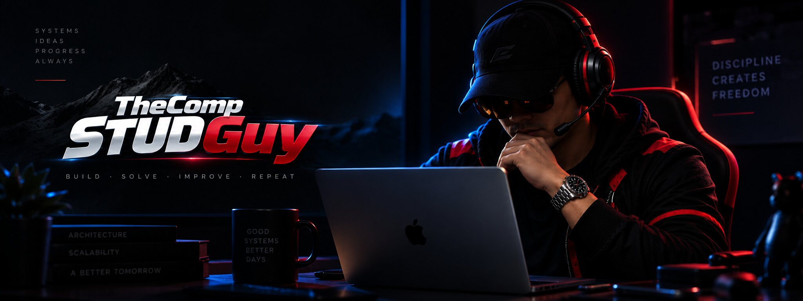

  

<h1 align="center">Hey, I'm TheCompSTUDGuy 👋</h1>

  <em>Backend-brained developer building things, breaking things, and occasionally understanding why.</em> 
  Professional tab collector. Part-time deadline speedrunner. 
  <strong>they/them</strong>

---

  

## ☕ Currently Building: UniversiTEA

**UniversiTEA** is a longer-term experiment around campus conversations, communities, anonymity, social dynamics, and the wonderfully questionable things people say when you give them a cup of tea and a pseudonym.

I'm building it progressively instead of trying to design the final platform all at once: get the core experience working, learn from how people actually use it, then grow it intentionally.

📄 [Read the UniversiTEA MVP brief](https://github.com/thecompstudguy/universitea-tg/blob/main/docs/briefs/MVP.md)

---

## About Me

I turn late-night ideas, milk tea, and an unreasonable number of browser tabs into things people can actually use.

I like building software, figuring out how systems fit together, and learning from every bug that decides to become a side quest.

- Mostly backend-brained, but comfortable shipping full stacks.
- I like understanding the shape of a system before worrying about every implementation detail.
- I'll happily work in a language I barely know if I understand the problem I'm trying to solve.
- Known to overthink simple problems and underthink complex ones. Working on it.
- Focused on **shipping**, not just tinkering: build small, learn fast, scale intentionally.
- Balancing gym reps with GitHub commits, with mixed results on both.

---

## How I Build

- Start with the problem and the boundaries between things.
- Keep the implementation understandable until complexity earns its place.
- Use boring technology when boring technology works.
- Make the architecture deliberate without turning every project into an enterprise platform.
- Ship something real before designing version seventeen.

---

## 🛠 Other Things I'm Exploring

I'm deliberately spending more time inside codebases I didn't create.

Less blank canvas, more:

> "Okay, why is this like this?"

Reading other people's decisions, fixing small things, improving what's already there, and contributing without redesigning everything is a different skill from starting from scratch — and one I want to get better at.

Open source is part of that. Sometimes the contribution is code. Sometimes it's documentation. Sometimes it's just understanding a weird corner of a project well enough to leave it slightly better than I found it.

---

## Things I've Been Using

- **Languages:** Java, JavaScript / TypeScript, PHP, Python
- **Frontend:** React, Vite
- **Backend:** Node.js, Serverless Framework
- **Cloud / Infra:** AWS, Linux, GitHub
- **Data:** MySQL, DynamoDB

This list changes. I care more about choosing tools that fit the problem than collecting technologies for the sake of the list.

---

## Say Hi

I'm usually somewhere between GitHub, Reddit, and too many open browser tabs.

- 📧 the.compstud.guy@universitea.shop
- 🔗 [Reddit](https://www.reddit.com/user/Appropriate-Cod7548/)

If you found something weird in one of my projects, there's a decent chance I'd genuinely like to hear about it.

---

  <em>"If it compiles, it ships." – ancient programmer proverb</em>

